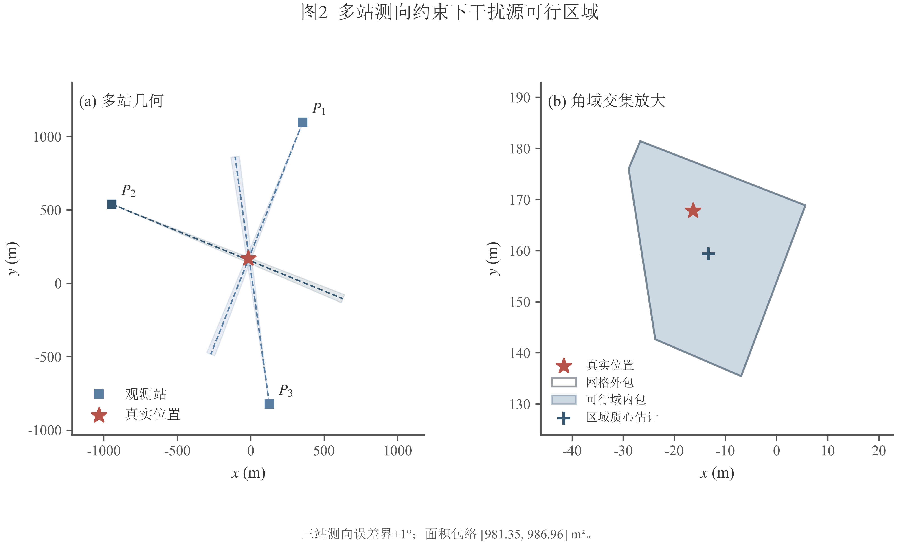
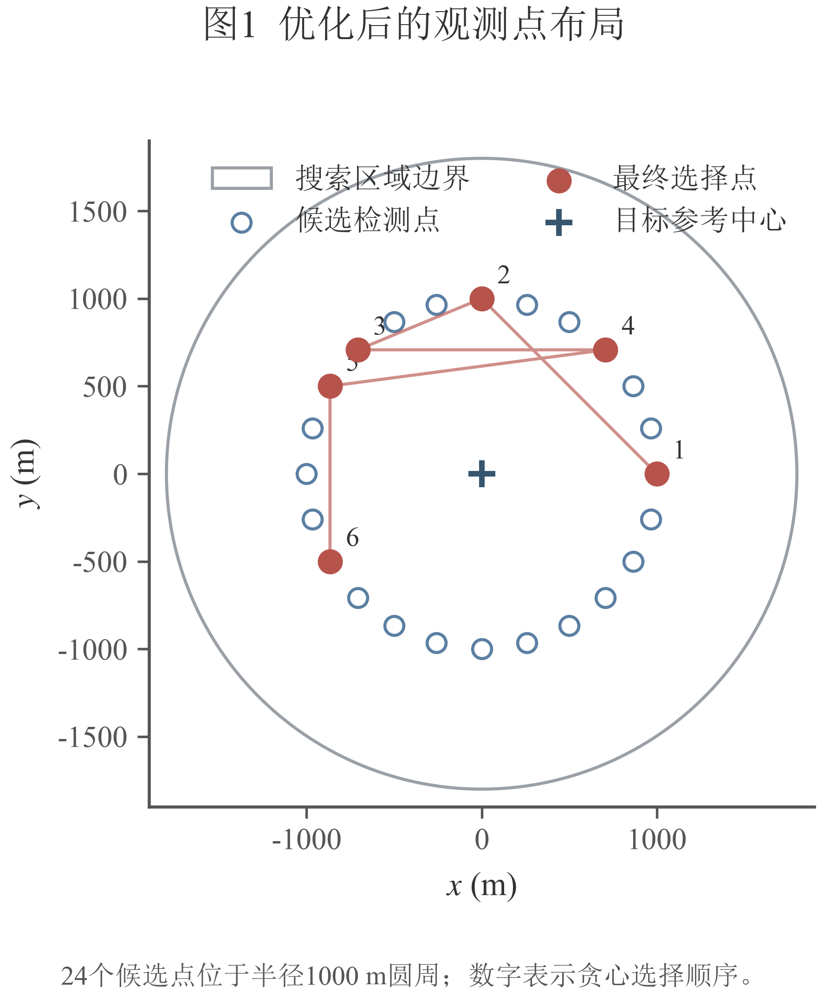
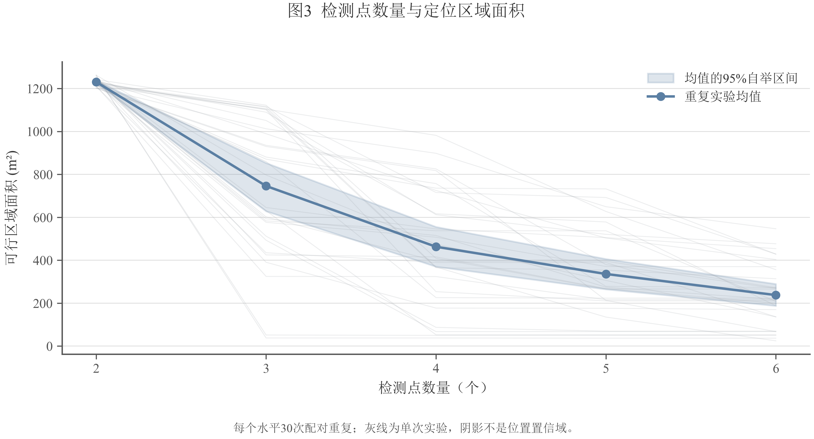
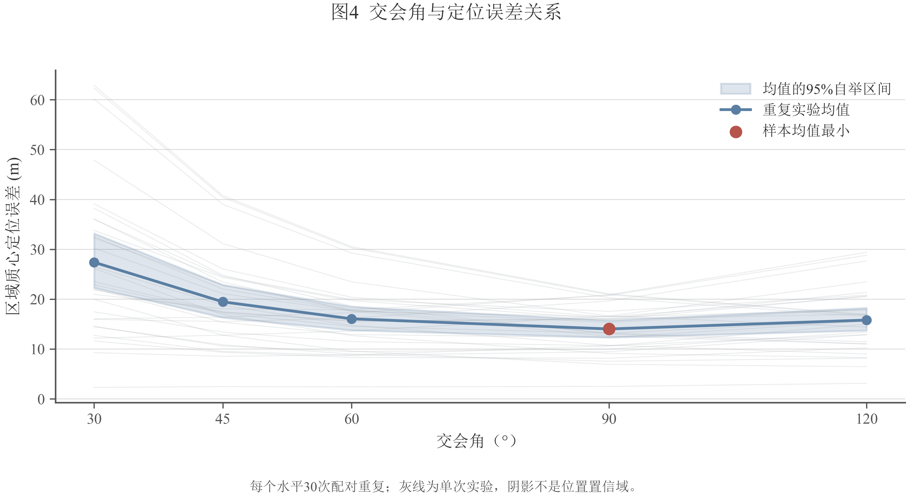

# 有界测向误差下干扰源的确定性区域定位与机器人覆盖清除

> 说明：本文为可直接进入队内修改与最终排版的论文草稿。正式提交前需补入参赛队号、三次正式测试的案例编号及对应成绩，并按当年论文模板调整页眉与承诺书。文中主模型均为已经工程实现并完成验证的冻结版本；被否决的算法只出现在消融实验中。

## 摘要

针对圆形场地内干扰源的测向定位、观测点选择及机器人自主清除问题，本文建立了一套由确定性可行域贯穿四问的统一模型。首先，将单次带有 ±1° 有界误差的示向观测表示为前向角域，并与半径 1800 m 的场地圆盘及其他观测的角域相交，得到真实源位置的可行区域 Ω。利用半平面等价表示和自适应网格内外包络，计算 Ω 的面积、直径、最小覆盖圆及质心，同时给出离散误差界。其次，问题二不重新建立定位器，而将候选检测点逐一输入问题一，以 Ω 面积外包、直径外包和交会角构成字典序准则，滚动选择观测几何。420 次实验表明，本文布局的平均 Ω 面积为 462.89 m²，低于随机布局的 638.53 m²、均匀圆周布局的 520.17 m²和 DOP 诊断基线的 574.53 m²；相对 DOP 的配对面积差为 −111.65 m²，95% 自举区间为 [−232.06, −0.35] m²。

对于全向干扰源，本文采用“原点加半径 1200 m 正六边形”的 7 点确定性覆盖布局，按蛇形频道顺序扫描，并以 Ω 最小覆盖圆判据、最大交会角最小二乘估计、受限顺路清除、任务级开放路径 2-opt 和二分归航组成串行状态机。1000 例离线自检的清除率为 100%，实机 7 局全部全清，时间波动的 92.1% 可由随机源数量解释。对于含未知指向定向源的混合场景，进一步构造边长 900 m、边界裕度 800 m 的 31 点三角网格，并以“覆盖三角形三个顶点对某频道均无信号”作为该三角形的排除证书；全部覆盖三角形均被证伪时才退役该频道。实机 11 局均全清且证书索引正确，剔除一个困难定向源导致的长尾局后，虚拟时间变异系数为 3.1%。通过配对消融，本文否决了概率排序、DOP 预筛、PSO 精化、多方向复核、LS 信任门限和补测距离上限等未能稳定改善目标的模块，最终保留简洁、可解释、可复现的确定性路线。

**关键词：** 有界测向误差；可行区域；观测几何；确定性覆盖；路径调度；消融实验

## 1 问题重述

目标区域为以原点为圆心、半径 1800 m 的圆盘。干扰源占用 1—20 号互异频道，接收半径在 1000—1500 m 之间；机器人以 5 m/s 移动，换频耗时 1 s，检测耗时 5 s。检测若位于干扰源 5 m 范围内返回 near；否则在可接收条件下返回示向角，误差不超过 ±1°。机器人进入源 20 m 范围后可执行光学定位并清除。问题一要求由若干示向结果确定干扰源可能区域；问题二要求选择检测点并评价布局；问题三要求清除 10—16 个全向源；问题四将源扩展为全向与定向混合，且定向源只在自身指向两侧各 90° 范围内发射。

四问并非彼此独立。问题一提供统一的区域定位器；问题二研究观测几何如何收缩该区域；问题三把定位器嵌入全向场景的覆盖—定位—清除流程；问题四只改变“可见性”模型，并以更强的空间覆盖证书解决无信号歧义。本文的总目标是在全清这一硬约束下，减少移动、测量和失败清除造成的虚拟时间，并保证 HTTP+JSON 串行通信、请求幂等和状态记录可审计。

## 2 问题分析与总体框架

### 2.1 四问的共同数学对象

示向观测给出的是方向区间而非精确射线，也不是距离观测。因此，任何直接求两射线交点的方法都会把有界误差错误地压缩为一个点。本文将每次观测转化为一个前向凸角域 Ωᵢ，并定义

$$Ω = B_R ∩ Ω₁ ∩ Ω₂ ∩ ··· ∩ Ωₙ,$$

其中 B_R 为场地圆盘。只要所有测量误差均在规定界内，真实源必在 Ω 中。问题二所优化的不是某个概率意义下的“最可能位置”，而是新增观测后 Ω 的收缩程度。问题三、四中，当 Ω 的最小覆盖圆半径不超过 20 m 时，前往覆盖圆心即可获得与清除半径一致的确定性安全判据；否则才使用最小二乘交会点作为低成本试探位置，并由归航机制兜底。

### 2.2 时间目标的分解

对一条串行动作序列，虚拟时间写为

$$T = L/5 + 5N_m + N_s + 5N_c^+ + 3N_c^-,$$

其中 L 为移动距离，N_m 为检测次数，N_s 为换频次数，N_c^+、N_c^- 分别为成功和失败清除次数。由于场地尺度以千米计，移动通常是主导项；但盲目减少测量会造成较差定位并触发长距离归航。因此本文采用分层目标：首先保证全部源被发现和清除，其次减少移动距离和失败清除，最后才在同等安全水平下减少检测次数。

### 2.3 总体算法流程

1. 将检测返回的示向角转化为问题一的有界角域，实时更新每个频道的 Ω。
2. 在需要主动增测时，由问题二的字典序准则评价候选点，不另建概率定位器。
3. 问题三用 7 个固定覆盖点扫描全向源，定位成熟的频道可在扫描路径中顺路清除，其余进入清除队列。
4. 问题四用三角网格环绕定向源，以逐频道的三角形无信号证书决定频道是否可安全退役。
5. 所有网络请求严格串行；每个新动作生成唯一 request_id，网络重试复用同一 request_id 和完全相同的请求体；仅在 accepted=true 且 clear_result=success 时更新 cleared 状态。

## 3 模型假设与符号说明

### 3.1 基本假设

1. 干扰源在单局测试中位置、频道和定向方向保持不变。
2. 机器人位置及坐标系准确，示向误差绝对值不超过官方给定上界。
3. 同一频道至多对应一个干扰源，各源频道互异。
4. 场地内无障碍物，直线移动可行；所有动作按接口返回的虚拟时间串行发生。
5. `accepted=false`、HTTP 错误或通信异常均不视为业务动作成功；未知状态不得被写为已清除。
6. 随机误差分布只用于重复实验评价典型性能，不参与确定性真值包含证明。

### 3.2 主要符号

| 符号 | 含义 |
|---|---|
| R | 场地圆盘半径，R=1800 m |
| Pᵢ=(xᵢ,yᵢ) | 第 i 个检测位置 |
| θᵢ | 第 i 次检测返回的示向角 |
| δ | 示向误差界，默认 1° |
| Ωᵢ | 单次观测对应的前向角域 |
| Ω | 所有观测与场地约束的联合可行区域 |
| A(Ω), D(Ω) | Ω 的面积与直径 |
| r*(Ω) | Ω 的最小覆盖圆半径 |
| α | 两条有效示向的交会角 |
| L, T | 总移动距离与总虚拟时间 |
| ΔL | 将清除任务插入当前路径的额外移动距离 |
| δ_on | 顺路清除阈值，冻结值 300 m |

## 4 问题一 有界测向误差下的区域定位

### 4.1 单站角域与真值包含性

设候选源位置 X=(x,y)，从 Pᵢ 指向 X 的方位角为

$$φᵢ(X)=atan2(y-yᵢ,x-xᵢ) mod 360°.$$

定义圆周角距离

$$d_S(a,b)=|((a-b+180°) mod 360°)-180°|.$$

则单站可行域和联合区域分别为

$$Ωᵢ={X≠Pᵢ: d_S(φᵢ(X),θᵢ)≤δ},$$

$$Ω=B_R∩⋂_{i=1}^n Ωᵢ.$$

若真实位置 S 位于场地内且每次观测满足 d_S(φᵢ(S),θᵢ)≤δ，则 S 同时满足所有约束，故 S∈Ω。这一结论是条件确定性保证，不是置信概率。

### 4.2 等价半平面与凸性

令 uᵢ⁻、uᵢ⁺分别为方向 θᵢ−δ 与 θᵢ+δ 的单位向量，uᵢ⁰为 θᵢ 的单位向量。角域闭包可写为

$$cross(uᵢ⁻,X-Pᵢ)≥0,$$

$$cross(uᵢ⁺,X-Pᵢ)≤0,$$

$$uᵢ⁰·(X-Pᵢ)≥0.$$

前两式给出角域边界，第三式保留射线的前向性。由于半平面与圆盘均为凸集，Ω 的闭包也是凸集，这使面积、直径、最小覆盖圆及后续观测点比较均可稳定计算。

### 4.3 自适应网格的内外包络

将 [−R,R]² 初始划分为 200×200 个方格。对中心 c、半边长 h 的格子，任一线性约束 a·X−b 在格内的范围为

$$[a·c-b-h||a||₁, a·c-b+h||a||₁].$$

若某约束的最大值仍小于 0，或格子到原点的最近距离超过 R，则整格被排除；若全格满足所有半平面且最远角点仍在圆盘内，则整格被确认为内部；其余边界格四分细化，直至边长不超过给定精度。对通过原始 atan2 角距检验的点取凸包 K_in，对所有保留叶格角点取凸包 K_out，得到

$$K_in⊆cl(Ω)⊆K_out.$$

这一区分避免了把离散采样点集误认为连续区域，也避免细长可行域穿过格子却因格心不满足约束而被错误删除。

### 4.4 区域指标

面积使用鞋带公式，并由内外包给出 A_in≤A(Ω)≤A_out。直径在凸包顶点间计算，得到 D_in 与 D_out。最小覆盖圆半径定义为

$$r*(Ω)=min_c max_{X∈Ω} ||X-c||₂.$$

内外凸包分别给出覆盖半径下界与安全上界。论文采用外包最小覆盖圆作为清除判据；不能简单把“区域直径的一半”作为覆盖半径，因为等边三角形的最小覆盖圆半径为 D/√3>D/2。

### 4.5 实验结果

固定种子 202604004013，每组 30 次重复，共完成 450 次求解。检测点从 2 个增加到 6 个时，平均 Ω 面积由 1225.40 m² 降至 192.96 m²，平均覆盖半径由 24.91 m 降至 11.23 m；误差界由 0.2° 增至 2° 时，平均 Ω 面积由 27.95 m² 增至 4480.56 m²。两站交会角为 90° 时平均定位误差为 14.36 m，优于 30° 时的 27.49 m。450/450 次真值均满足角度误差界；最大面积包络宽度为 13.7949 m²，最大直径上下界差为 0.2358 m，最大覆盖半径上下界差为 0.1179 m。



**模块说明。** 数学上，本模块计算所有有界角约束的交集；设计上，用区域而非单点保存测向不确定性；正确性由真值包含、独立半平面裁剪和网格收敛共同验证；输出包括 Ω 的内外包络、面积、直径、最小覆盖圆、质心及离散误差界。

## 5 问题二 基于 Ω 收缩的观测点布局优化

### 5.1 问题一到问题二的接口

已有观测形成 Ω_k。问题二只负责选择下一检测点 P，使新观测加入后

$$Ω_{k+1}(P)=Ω_k∩Ω_{new}(P)$$

尽可能小，再把 P 和观测结果送回问题一。为避免把不可比量纲强行加权，本文对候选点采用字典序指标

$$J(P)=(A_out(Ω_{k+1}),D_out(Ω_{k+1}),-α_min(P),index(P)).$$

先最小化面积外包上界；面积相同或数值接近时，再比较直径外包；仍相同时优先较好的条件交会角，最后用候选编号保证固定种子下完全复现。

### 5.2 候选区域和滚动选择

以当前 Ω 的代表中心 ŝ 为参考，在距 ŝ 约 1000 m 的圆周上每 15° 取一个候选点，共 24 点，并删去场地外或不满足相邻移动限制的点。每一轮枚举所有合法候选点，调用问题一计算假设加入该观测后的 Ω 指标，选择字典序最小者。受控几何实验以真值代替 ŝ，只用于隔离布局本身的影响；在线执行时 ŝ 必须来自当前 Ω，不能使用未知真值。



### 5.3 对照实验

420 次实验均复用同一场景和误差向量进行配对比较。最终布局平均指标如下。

| 方法 | Ω面积/m² | 直径/m | 覆盖半径/m | 定位误差/m | DOP |
|---|---:|---:|---:|---:|---:|
| 本文 Ω 面积贪心 | 462.89 | 31.86 | 16.45 | 8.18 | 1.000 |
| 随机布局 | 638.53 | 47.47 | 23.94 | 11.39 | 1.231 |
| 均匀圆周布局 | 520.17 | 32.46 | 16.32 | 8.27 | 1.000 |
| DOP 诊断基线 | 574.53 | 34.76 | 18.11 | 10.23 | 1.000 |

本文布局相对随机布局的配对面积差为 −175.64 m²，95% 自举区间为 [−329.21, −23.17] m²；相对 DOP 的配对面积差为 −111.65 m²，区间为 [−232.06, −0.35] m²。均匀圆周布局的平均覆盖半径 16.32 m 略小于本文的 16.45 m，因此本文只宣称在主要目标 Ω 面积和直径上占优，不宣称所有指标均最优。

检测点由 2 个增至 6 个时，本文嵌套布局的平均面积由 1230.92 m² 降至 237.77 m²。交会角实验中 90° 的平均定位误差最低，为 14.02 m，验证了几何条件对定位精度的影响。





**模块说明。** 数学上，本模块求解受可达性约束的离散序贯设计问题；设计上，始终用问题一的 Ω 评价候选点并保留量纲；正确性由同场景配对、420 个唯一实验编号和独立半平面参考解验证；输出包括候选点逐项指标、贪心轨迹、布局间配对差和自举区间。

## 6 问题三 全向干扰源的覆盖定位与清除

### 6.1 确定性覆盖布局

问题三全部为全向源。冻结方案取 7 个扫描点：原点和半径 1200 m 正六边形的 6 个顶点。布局在最小接收半径 1000 m 的保守口径下覆盖圆盘，并通过离线几何枚举验证任意源具有至少两个可用检测位置。该布局兼顾固定扫描路程、每频道检测次数和双站交会条件。

机器人沿开放路径访问 7 点，在奇数站按频道 1→20、偶数站按 20→1 检测。蛇形频道顺序减少相邻站之间额外的首尾换频；某频道若已获得满足定位条件的新观测，则跳过对其几何上冗余的重复检测。

### 6.2 定位成熟度与执行位置

每个频道维护问题一的 Ω。当 Ω 外包最小覆盖圆半径 r_out≤20 m 时，覆盖圆心为安全清除目标，记为 MEC 档。若 Ω 尚大，则选择交会角最大的两条示向求最小二乘交点

$$ĝ=[Σ(I-dᵢdᵢᵀ)]^{-1}Σ(I-dᵢdᵢᵀ)Pᵢ,$$

其中 dᵢ=(cosθᵢ,sinθᵢ)。该点只作为低成本执行估计，记为 LS 档；若清除失败，状态机继续补测或归航，不能将失败请求误记为已清除。

### 6.3 顺路清除与队列调度

扫描从当前点 A 前往下一扫描点 B 时，对已定位频道的目标 G 计算插入增量

$$ΔL=||A-G||+||G-B||-||A-B||.$$

仅当 ΔL≤δ_on=300 m 时执行顺路清除。扫描结束后，将其余清除任务以“频道、坐标、定位来源”组成不可分割元组，先用最近邻构造开放路径，再用包含尾段反转的 2-opt 改进。任务级表示避免多个频道估计在同一坐标时通过坐标反查导致覆盖或错配。

### 6.4 失败兜底与结束条件

仅有单示向或交会退化时，先在垂直于示向的方向选点补测，以形成较大交会角；仍不能可靠定位时，沿已有示向进行二分归航。`_homing_clear` 返回布尔值，只有 HTTP 请求被接受且 `clear_result=success` 才把频道标记为 cleared。退出前逐频道核验，`unresolved_list` 非空则记录警告，不用程序内部估计替代模拟器确认。

### 6.5 离线与实机结果

1000 例离线自检全部清除，平均移动 18462 m、平均检测 136 次、估计虚拟时间 4371 s。7 局可比实机日志均全部清除，平均虚拟时间为 3997.5 s，标准差 522.2 s，变异系数 13.1%。回归结果为

$$T₃≈1370+211.4N_source,
R²=92.1%.$$

因此总时间表面波动主要来自每局源数 10—16 的随机变化，而不是程序失稳。剔除固定扫描成本后，扫描后时间按源归一约为 164—204 s/源；7 局平均总时间/源约 325 s。

| 验证项 | 结果 |
|---|---:|
| 离线自检 | 1000/1000 全清 |
| 实机有效局 | 7/7 全清 |
| accepted=false | 0 |
| 重复 request_id | 0 |
| unresolved_list 非空 | 0 |
| 总时间与源数回归 R² | 92.1% |

**模块说明。** 数学上，本模块是覆盖路径、区域定位和开放路径调度的串行组合；设计上，固定覆盖保证发现，300 m 插入阈值控制顺路绕行，失败归航保证状态闭环；正确性由 1000 例自检、实机请求唯一性和退出前频道核验验证；输出包括动作级 JSONL、phase_stats、locate_stats、总距离、虚拟时间和未解决频道表。

## 7 问题四 混合方向源的证书化覆盖与清除

### 7.1 无信号的三义性

定向源只在一个 180° 半平面内发射。某频道返回 no_signal 可能表示频道不存在、检测点超出接收半径，也可能表示检测点落在方向盲区。因此问题三“若多站均无信号则不存在”的经验判断不能直接沿用。需要从环绕覆盖结构中构造可核验的排除证书。

### 7.2 31 点三角网格与排除证书

冻结方案在场地及边界裕度上布置边长 MESH_A=900 m 的三角网格，共 31 个顶点和 42 个覆盖三角形，MESH_MARGIN=800 m。程序对每个频道维护 no_signal 顶点集合 N_ch。若某覆盖三角形的三个顶点都属于 N_ch，则在接收距离与半平面可见性的保守几何条件下，该三角形内不存在该频道的定向源；当全部覆盖三角形均被证伪时，才将频道安全退役。

证书依赖真实网格编号而非访问次序。工程修正后，路径元素直接携带 (mesh_index,x,y)，31 个点各访问一次，原点只出现一次；摘要固定输出 certificate_index_ok。一个固定种子回归案例中，旧实现因编号混用把真实频道 8 误判为不存在，修复后 60 例证书测试达到 0 漏清、0 误排除，说明逻辑证书比小样本清除率更能揭示结构错误。

### 7.3 定位、调度和困难源处理

对已获得两条以上示向的频道，仍调用问题一计算 Ω，并沿用 MEC/LS 两档执行位置。扫描过程中使用 δ_on=300 m 的受限顺路清除，扫描后采用任务级开放路径 2-opt。单示向频道先选择最近的有效补测点；若补测落入盲区或交会角仍退化，则沿一条或多条历史示向分别进行二分归航。归航点清除失败后，在半径 8 m 和 15 m 的圆周上各取 6 个邻域点试探，作为低成本最后手段。所有失败都保留在日志中，后续成功才关闭频道。

### 7.4 实机稳定性

冻结版 11 局实机均实现全清、`unresolved_list=[]`、`certificate_index_ok=true`，平均虚拟时间 10784.0 s，标准差 701.8 s，变异系数 6.5%。其中一局耗时 12676.6 s，主要由单个困难定向源触发 4.66 km 远距离补测后仍仅形成 28.2° 交会角，继而再次归航。剔除此机制明确的长尾局后，其余 10 局平均 10594.7 s、标准差 330.7 s、变异系数 3.1%。因此当前不应把随机场景总时间差异解释为程序不稳定；应按源数、是否定向、是否触发补测/归航分层报告 P90、P95 和最大值。

| 阶段 | 主要动作 | 可观测诊断量 |
|---|---|---|
| mesh_scan | 三角网格逐频道扫描 | 移动、检测、无信号顶点、证书状态 |
| on_way | 300 m 阈值内顺路清除 | 插入距离、成功/失败、归航转移 |
| supplement | 单示向或退化几何补测 | 最近补测点距离、交会角、是否跳过 |
| homing | 沿示向二分归航 | episode 数、换示向次数、补回结果 |
| queue_clear | 剩余任务开放路径清除 | 队列路程、2-opt 改善、最终状态 |

**模块说明。** 数学上，本模块用三角剖分把定向半平面可见性转化为有限证书；设计上，只有证书完整才排除频道，其他情形继续定位和归航；正确性由网格索引一致性、固定种子证书回归和实机全清核验保证；输出包括逐频道三角形证书、supp_diag、homing_diag、分阶段时间及长尾来源。

## 8 消融实验与冻结决策

### 8.1 为什么不把复杂算法写入主模型

本文以“同一随机场景、同一随机种子、只改变一个模块”的配对方式评价候选改进。判断顺序为：全清率和证书正确性不能下降；其次看总时间、移动距离及 P90/P95/最大值；若均值差的置信区间跨 0 或收益只在极少数场景出现，则不修改正式默认值。由此，算法复杂度本身不构成采用理由。

### 8.2 问题二布局消融

随机布局、均匀圆周、DOP 筛选与 Ω 面积贪心使用相同候选集和观测误差。Ω 面积贪心相对 DOP 的面积差区间整体小于 0，而 DOP 不包含场地截断、非线性角域和距离造成的区域宽度，因此 DOP 只保留为诊断指标，不进入最终选点目标。

### 8.3 问题三 LS 清除门限

MEC 档首次清除成功率为 100%，LS 档约为 89.6%—91.8%，但这并不意味着应拒绝 LS 点试探。对同一批 300 例设置 Ω 半径门限，结果如下。

| LS 允许条件 | 清除率 | 相对当前时间/s | 相对当前移动/m |
|---|---:|---:|---:|
| 当前：不设门限 | 100% | 0 | 0 |
| Ω≤40 m | 100% | +24.6 | +78.6 |
| Ω≤30 m | 100% | +421.5 | +1880.8 |
| Ω≤25 m | 100% | +892.9 | +4031.6 |
| Ω≤20 m，仅 MEC | 100% | +2646.0 | +12016.8 |

失败清除只损失 3 s，之后仍有归航兜底；拒绝试探则立即增加一次检测和往返移动。因此门限越紧越差，正式值保持 `LS_CLEAR_GATE=None`。

### 8.4 问题四顺路阈值的实机交错实验

对 δ_on=300 m 与 500 m 进行 300→500→500→300 的同时间窗交错实机测试，并用全部可用实机日志按源归一。500 m 确实把更多清除前移到扫描阶段，使扫描后时间每源减少 30.4 s；但顺路绕行每源增加 51.5 s，最终总时间每源增加 56.0 s，归航和失败清除也略增。因此正式值保持 300 m。

| 指标 | 300 m，16局 | 500 m，4局 | 差值 |
|---|---:|---:|---:|
| 总虚拟时间/源/s | 788.4 | 844.4 | +56.0 |
| 顺路时间/源/s | 49.7 | 101.2 | +51.5 |
| 扫描后时间/源/s | 121.0 | 90.6 | −30.4 |
| 清除阶段时间/源/s | 170.7 | 191.8 | +21.1 |
| 归航 episode/局 | 0.2 | 0.5 | +0.3 |

### 8.5 问题四邻域圈与补测距离上限

每档 400 例的邻域四臂实验显示，取消邻域试探并未降低时间，反而把负担转移给重复二分归航；仅保留 15 m 圈虽节省约 1—2 s，但收益仅约 0.02%，不足以在缺少实机证据时改变默认值，故保留 8 m+15 m 两圈。

补测距离上限取 1500、2500、3500 m 时，两种定向比例下均保持 100% 全清，但所有时间差 95% 区间均跨 0，且多个阈值使最大时间增加。以 100% 定向为例，基线平均/P95/最大为 10704/11392/12159 s，2500 m 上限为 10705/11367/13136 s：P95 略降而最大值增加 977 s，未达到稳定压缩长尾的目标，故 `SUPP_MAX_DIST=None`。

### 8.6 其他被否决模块

| 模块 | 实验现象 | 决策 |
|---|---|---|
| 概率图排序 | 问题三时间增加约 789 s | 关闭 |
| DOP 预筛 | 问题三时间增加约 84 s | 关闭 |
| 改进 PSO 精化 | 定位误差改善不足 0.1 m | 关闭 |
| 清除后多方向复核 | 增加约 11.9 km、2536 s，完成率无提升 | 关闭 |
| 负信息联合可行域 | 当前流程中几乎不触发，8 例与基准完全一致 | 关闭 |

## 9 模型检验、稳定性与复现

### 9.1 数学正确性检验

问题一覆盖角度环绕、正向性、空集、平行方向、零误差、窄区域、圆边界、解析多边形、最小覆盖圆穷举和直径圆反例。问题一与问题二共 21 项单元测试通过；420 组问题二实验均通过独立半平面裁剪参考解校验，最大定位误差离散差约 0.0243 m。

### 9.2 状态机与通信检验

客户端对 HTTP status code 与 JSON `accepted` 同时判断，显式处理 ConnectionError、Timeout、HTTP 400/409/415/429 及 accepted=false。网络异常重试同一动作时复用 request_id 和请求体，避免模拟器把重试识别为新动作。日志记录 request_id、HTTP 状态、accepted、virtual_time_s、measure_result 或 clear_result 及完整响应 JSON。问题三、四的有效实机日志中 accepted=false 和重复 request_id 均为 0。

### 9.3 稳定性口径

随机源数量和定向难度不同，单纯比较整局总时间会产生错误结论。问题三报告固定覆盖成本和扫描后每源时间；问题四除每源指标外，还按补测与归航是否触发分层，并报告 P90、P95、最大值。正式测试前采用以下验收条件：全清率 100%；`unresolved_list=[]`；HTTP 拒绝数 0；问题四 `certificate_index_ok=true`；固定种子重复结果逐例一致；长尾局能够由 phase_stats 和 episode 诊断解释。

### 9.4 正式测试结果表

下表必须在正式测试后从原始 JSONL 自动生成，当前不填造案例编号或成绩。

| 问题 | 正式案例编号 | 源数 | 清除数 | 清除比例 | 总虚拟时间/s | 平均定位清除时间/s | unresolved | 证书正确 |
|---|---|---:|---:|---:|---:|---:|---|---|
| 3 | 待填 | 待填 | 待填 | 待填 | 待填 | 待填 | 待填 | 不适用 |
| 3 | 待填 | 待填 | 待填 | 待填 | 待填 | 待填 | 待填 | 不适用 |
| 3 | 待填 | 待填 | 待填 | 待填 | 待填 | 待填 | 待填 | 不适用 |
| 4 | 待填 | 待填 | 待填 | 待填 | 待填 | 待填 | 待填 | 待填 |
| 4 | 待填 | 待填 | 待填 | 待填 | 待填 | 待填 | 待填 | 待填 |
| 4 | 待填 | 待填 | 待填 | 待填 | 待填 | 待填 | 待填 | 待填 |

## 10 模型评价

### 10.1 优点

1. 四问共用 Ω 这一数学对象，定位、选点、覆盖与清除之间接口清楚，避免各问模型口径不一致。
2. 有界误差被表示为可证明包含真值的区域，内外包络同时给出数值精度，不把离散点集或随机置信区间误写为确定性区域。
3. 问题三、四的主路径全部由可解释几何、确定性覆盖和串行状态机组成，参数少、结果可复现、实机日志可审计。
4. 采用同场景配对消融和硬约束优先的冻结规则，能够拒绝“均值偶然变好但尾部或工程风险恶化”的复杂模块。

### 10.2 局限

1. 问题二的候选集为离散圆周点，在线代表中心偏差较大时，布局效果可能弱于受控实验。
2. 自适应网格提供数值内外包络而非形式化有向舍入证明，退化到零面积集合时需要提高精度或单独判断。
3. 问题四的个别长尾来自定向源补测信息价值不可预知；仅用补测距离设置阈值不能区分“远但有效”和“远且无效”。
4. 实机测试局数仍有限，正式评价应继续报告三次官方测试原始结果，不能只引用离线均值。

## 11 结论

本文以有界测向误差可行区域 Ω 为核心完成四问统一建模。问题一给出真值包含的区域定位与可控离散误差；问题二用 Ω 收缩直接评价观测点布局，实验证明面积贪心布局在主要指标上优于随机、均匀和 DOP 诊断基线；问题三以 7 点确定性覆盖、受限顺路清除和开放路径调度实现全向源稳定全清；问题四以 31 点三角网格和逐频道排除证书解决方向盲区的无信号歧义。大量配对消融表明，复杂算法并未自动带来更好结果，最终冻结方案在全清、证书正确和实机稳定性之间取得了可靠平衡。

正式测试时，问题三应重点报告扫描后每源时间，问题四应同时报告补测/归航分层和尾部指标。若三次正式测试仍满足全清、无未解决频道、无 HTTP 拒绝、证书索引正确，则可认为本文不仅完成数学建模，也具备继续参赛所需的工程稳定性。

## 参考文献

[1] 2026 年全国大学生数学建模竞赛 B 题：机器人自动定位并清除干扰源，赛题及附件。

[2] 项目实验记录：问题一、问题二验证报告，问题三、问题四 JSONL 实机日志与配对消融结果，2026。

## 附录 A 冻结参数

| 模块 | 参数 | 冻结值 |
|---|---|---|
| 问题一 | 场地半径 | 1800 m |
| 问题一 | 示向误差界 | 1° |
| 问题一 | 初始网格 | 200×200 |
| 问题二 | 候选半径/角间隔 | 1000 m / 15° |
| 问题三 | 覆盖点 | 原点+R=1200 m 正六边形 |
| 问题三、四 | 顺路阈值 | 300 m |
| 问题三 | LS_CLEAR_GATE | None |
| 问题四 | 三角网格 | 边长 900 m，裕度 800 m，31点/42三角形 |
| 问题四 | 邻域试探圈 | 8 m、15 m，各6点 |
| 问题四 | SUPP_MAX_DIST | None |
| 复杂模块 | 概率/DOP/PSO/负信息/复核 | 全部关闭 |

## 附录 B 正式运行与复现

```powershell
python Problem1_Localization/main.py
python Problem1_Localization/validate.py
python Problem2_Observation_Optimization/main.py
python Problem2_Observation_Optimization/validate.py
python problem3_robot/selfcheck.py --cases 1000 --diag
python problem4_robot/selfcheck4.py --cert 60
python problem4_robot/selfcheck4.py 30 --diag
python problem3_robot/robot.py --robot-id 202604004013
python problem4_robot/robot4.py --robot-id 202604004013
```

正式接口运行时不得并发请求；若连接被拒绝，应先在模拟器中开始相应问题的演练测试并等待 5 s 倒计时结束。程序读取 `/enter` 返回的 `remaining_real_duration_s`，不预设固定 1200 s。
